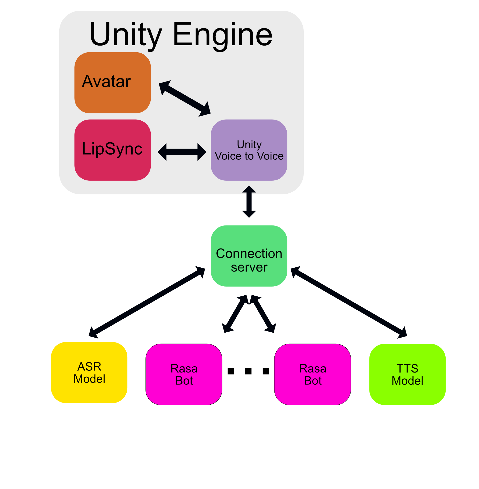

# AI_Movie_DB

Here is a movie and tv show recommendation system realized using several technologies.
It is a Unity based conversational agent with future expandability planned right in the architecture. 
## Demo

This is a demo of the current capabilities of the architecture

## Architecture

In here is reported a demo of the architecture so far

It consists of:
- Unity module to record and play audio, receive data like images
- Custom Connection Server implemented in python using FastAPI. This server handles the connection between ASR, Rasa and TTS
- ASR module, using Wav2Vec2 from speechbrain
- TTS module, using Speech_T5 from Microsoft
- Rasa, custom conversational agent
- The Movie DataBase for query real data

For now a request consists of the following steps:
- Unity records the audio
- Unity sends the full audio to the connection server
- The connection server sends the audio the ASR server to get the text transcription ( ASR )
- The connection server sends the text transcription received from the ASR server to Rasa server
- Rasa server receives the request and performs the NLU inference, eventually doing custom actions
  - A custom action may require the connection to TheMovieDataBase for the query answer
- The connection server receives the response from Rasa
- The connection server also requests from rasa tracker the current state
- The connection server sends a requests to TTS server for the speech synthesis ( TTS )
- The connection server receives the data and sends it back to Unity, by streaming chunks
- Unity plays the audio file ( with LipSync )

## Credits
- Unity for the engine
- Speechbrain and Huggingface for the ASR model https://huggingface.co/speechbrain/asr-wav2vec2-commonvoice-en
- Rasa for the creation of the custom agent https://rasa.com
- Microsoft and Hugginface for the TTS model https://huggingface.co/microsoft/speecht5_tts
- The Movie Database and celiao for the API and API wrapper for real movies data https://www.themoviedb.org https://github.com/celiao/tmdbsimple
- uLipSync for the LipSync and the demo scene. https://github.com/hecomi/uLipSync