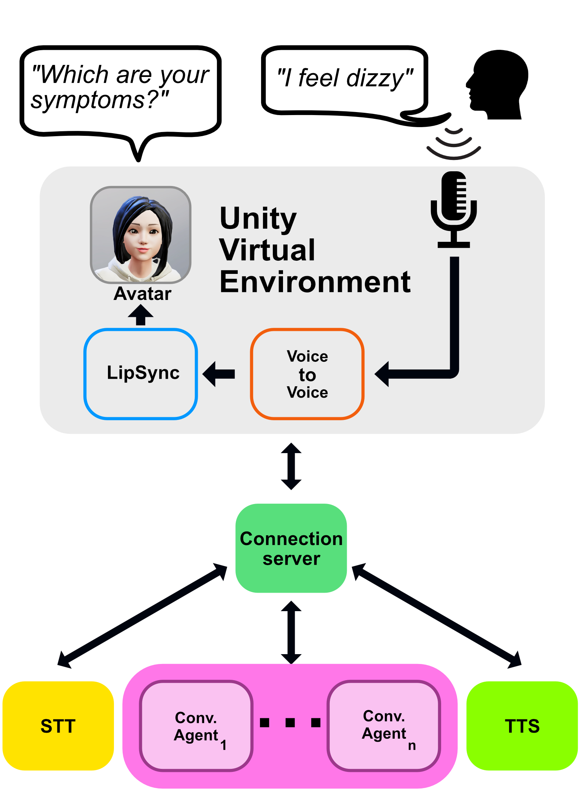

# AI_Movie_DB

Here is a movie and tv show recommendation system realized using several technologies.
It is a Unity based conversational agent with future expandability planned right in the architecture. 
## Demo

This is a demo of the current capabilities of the architecture for MovieBot

This is a demo of the capabilities for the architecture for Hospital


## Architecture




In here is reported a demo of the architecture so far


It consists of:
- Unity module to record and play audio, receive data like images
- Custom Connection Server implemented in python using FastAPI. This server handles the connection between ASR, Rasa and TTS
- ASR module, using Wav2Vec2 from speechbrain
- TTS module, using Speech_T5 from Microsoft
- Rasa, custom conversational agent
- The Movie DataBase for query real data


For now a request consists of the following steps:
- Unity records the audio
- Unity sends the full audio to the connection server
- The connection server sends the audio the ASR server to get the text transcription ( ASR )
- The connection server sends the text transcription received from the ASR server to Rasa server
- Rasa server receives the request and performs the NLU inference, eventually doing custom actions
  - A custom action may require the connection to TheMovieDataBase for the query answer
- The connection server receives the response from Rasa
- The connection server also requests from rasa tracker the current state
- The connection server sends a requests to TTS server for the speech synthesis ( TTS )
- The connection server receives the data and sends it back to Unity, by streaming chunks
- Unity plays the audio file ( with LipSync )


## How to run

The model consists of a very complex architecture, so detailed instructions are provided to run the sample scene.

### Requirements

You will need a working installation of Rasa and Unity. You can check how to install both by following these instructions

- https://rasa.com/docs/rasa/installation/installing-rasa-open-source/
- https://unity.com/download

Alternatively you can create the rasa environment by runnning
`conda create -f server/rasa_bots/environment.yml`
and afterwards running  `python -m spacy download en_core_web_lg`

### Set up Rasa bots
This project contains 4 bots, 3 related to the healthcare environment and one for movie domain
```
    rasa_bots  -- rasa_triage
            \  -- rasa_anamnesis
             \ -- rasa_operation
              \-- movie_bot 
```
In here we will explain how to set up each of them to get the full experience. It is possible to replace these bots with other Rasa based bots.
#### Movie Bot

##### The movie database account
Since the model uses real data from The Movie Database, you will need an API KEY in order to make successful requests. 

Register the TMDB and get a API KEY one at this link https://developers.themoviedb.org/3/getting-started/introduction.
##### Model
After you are done installing Rasa, install the other requirements from `server/rasa_bots/rasa_movie_bot/actions/short requirements.txt`.
Since this model uses sapcy `en_core_web_lg` you will need to install that as well.
You can use `python -m spacy download en_core_web_lg` to download that.

Once that is done, you can go to `server/rasa_bots/rasa_movie_bot/`. In a terminal write:
```bash
rasa train --domain ./domain --data ./data
```
This will start the training process using the data in the `./data` and `./domain` folders, with the current configuration

Once that is done, you will need to run two servers from the Rasa end:
- rasa action server, that communicates with the tmdb. Paste the API KEY in `server/rasa_movie_bot/actions/config.toml`
- rasa shell, that will perform the inference
In order to do both, open two terminals and in write respectively
```bash
rasa run actions -p 5054
```
```bash
rasa shell --enable-api -p 5004
```
This will start the two servers on localhost on the ports `:5054` and `:5004`

Test that the Rasa is working by writing on the second terminal simple questions like `Hello`


#### Hospital Rasa

For the hospital scene, you can do almost the same instructions, with a few key differences. 
There are three bots

Similarly as before you will need `spacy==3.5.1` and spacy `en_core_web_lg`
You can use 
```bash
pip install spacy=3.5.1
python -m spacy download en_core_web_lg
``` 
to download those.

Once that is done, you will need to train and activate each bot.
##### rasa_triage
```bash
cd server/rasa_bots/rasa_triage
rasa train --domain ./domain --data ./data
```
This will start the training process, which it will take a while
```bash
rasa shell --enable-api -p 5005
```
This will turn on the shell, with the REST API, on port 5005. Similarly to the movie bot, you will need a corresponding action server that can be run by
```bash
rasa run actions -p 5055
```

Do not close the shell, you will require the shell running in order to accept incoming request

##### rasa_anamnesis
```bash
cd server/rasa_bots/rasa_anamnesis
rasa train --domain ./domain --data ./data
```
This will start the training process, which it will take a while
```bash
rasa shell --enable-api -p 5006
```
This will turn on the shell, with the REST API, on port 5006. Similarly to the movie bot, you will need a corresponding action server that can be run by
```
rasa run actions -p 5055
```
Do not close the shell, you will require the shell running in order to accept incoming request
##### rasa_operation
```bash
cd server/rasa_bots/rasa_operation
rasa train --domain ./domain --data ./data
```
This will start the training process, which it will take a while
```bash
rasa shell --enable-api -p 5007
```
This will turn on the shell, with the REST API, on port 5007. This model does not require a action server.
Do not close the shell, you will require the shell running in order to accept incoming request
### Set up the server

Now you will need to run three other servers:       
- ASR server
- TTS server
- A server that ties everything toghever

Fortunately by default there is a ready to go solution

We **HIGHLY** suggest you to run these servers in a different environment from the one you are using Rasa.
In a different `python==3.10` environment install the requirements from `server/requirements.txt`

Alternatively you can directly build the environment by:
```bash
conda env create -f environment.yml
```

Activate your environment and open a terminal and write:
```bash
python server/main.py
```

by default each server is properly configured to run in `localhost` at different ports, respectively `:8081`, `:8082` and `:8080`. You can change these settings the the configuration of each server at `server/asr/config.toml` `server/tts/config.toml` `server/config.toml`
Also by default, the `server/config.toml` has communcation in place for port `5004`  `5005`, `5006`, `5007` for movie_bot, triage, anamnesis and operation respectively

Now you should have a terminal that each looks something like this


## Unity scene

Open the Unity project in `UnityKumo3D`. The editor version used for this demo is `2022.2.7f1` but it should work with any newer release. It may even work with older releases as there are very few dependencies.

You can start the demo by opening the scene `UnityKumo3D/Assets/Scenes/Demo.unity`

There is a GameObject called `ServerConnectionAuto` that handles the connection to the server. There are also many parameters that you may wish to change for a slighty different experience, but by default the scene should work.

You can change `bot` with the name of the bot specified in `server/config.toml` in order to switch the bot you are talking to.

The scene tries to detect your audio noise level and it sends the audio file whenever the noise level is above a threshold and then below a threshold for a certain amount of time. Since every device has a different microphone, a calibration button is included in the scene. 


Press the calibration button and try to say `Hello`, press again the same button to stop the calibration when you are done talking. This should approximately set the threshold the correct level required by your device, your tone of voice and the environment around you. 

Press the start recording button start talking.


## Build the App

You can use the Unity VE to build both iOS and Android releases. 
Due to developer limitations, only android releases are included in this repo.

- `Kumo.apk` is the default test scene
- `KumoVR.apk` is the version made for Oculus VR
- `HospitalVR.apk` is the hospital scene, made for Oculus VR

## Customization
Now that you can build the standard app, let's talk customization.

### ASR

the default ASR module runs at `http://localhost:8081` and it is built using FastAPI. You can check the available API at `http://localhost:8081/docs` if you run the server. 
At the moment it has only one path, `POST` `/asr`. At this path the model `asr-wav2vec2.0-commonvoice-en` is loaded and it is tasked to perform the ASR of any valid input `POST` audio file.
Since it relies on `soundfile.open()` any audio file that is supported by soundfile should work, but the model was tested and validated only on `.wav` files.
The result of the request should be a `JSON` file like this:
```json
  {
    "text" : "Hello",
    "is_final" : true
  }
```
It is possible to replace the ASR with any other service, as long as it provides the same API
### TTS

the default TTS module runs at `http://localhost:8082` and it is built using FastAPI. You can check the available API at `http://localhost:8082/docs` if you run the server. 
At the moment it has 4 available paths:
- `POST` `/tts`
- `GET` `/tts_synthesis`
- `GET` `/tts_synthesis_full`
- `GET` `/tts_speakers`

It is possible to change the implementation of the current TTS with another one as long as it provides the same API
#### POST tts
this path accepts as input a `JSON` file that contains the text to be synthetised.
```json
  {
    "text" : "Hello, I'm Kumo, a movie and tv show recommendation system",
  }
```
a `speaker` parameter is also required in order to chose the correct voice.

it outputs the a raw audio file, encoded in `PCM16` `signed integer` single channel at 16000Hz sampling rate. It is on the user to properly parse the raw data.
The raw data is also chunked, as it is processed according to punctuation marks present in the text. Punctuation marks are any character that matched this regex `;,\*\n\\\/\.\=\+\:\"`. 
This means that after any punctuation mark there is a "pause" of 100 zeros ( two zero bytes in PCM16 ) that can be used by the player to determine where to pause before playing the next chunk.

#### GET tts_synthesis
This request accepts two parameters:
- `speaker`, for the voice
- `text`, which is the text to be synthetised. 
For all intents and purposes it is a GET version of the `tts` ad everything else is the same
#### GET tts_synthesis_full
This request accepts two parameters:
- `speaker`, for the voice
- `text`, which is the text to be synthetised. 
Same as above, but without chunking of the data. One should expect long response times for long texts, wherease with the other two APIs this is negated by punctuation.
#### GET tts_speakers
This request returns a `JSON` list of possible speakers
### Server
This is the main server that handles the connection with everything else. I provides a few API:
- `GET` and `POST` `/text_converse`
- `POST` `/audio_converse_stream`
- `GET` `get_tracker`

The server has a configuration file `server/src/config.toml` that is loaded by default. This file specifies the addresses of the ASR and TTS modules, whether to start them automatically, which port to use and also a list of connected rasa agents. For each rasa agent it is possible to select the name, the port adn address at which they are found and the voice of the agent. 
#### GET text_converse
this API allows to send text messages with a rasa bot. It is useful for debugging.
it requires as parameters:
- `bot` bot to where to send the message
- `sender` unique ID of the sender
- `message` actual message
#### POST text_converse
this API allows to send text messages with a rasa bot. It is useful for debugging.
it requires as parameters:
- `bot` bot to where to send the message
The other arguments are sent as `JSON`
```json
  {
    "sender" : "Unity",
    "message" : "Hey"
  }
```
#### POST audio_converse_stream
This API is a simple wrapper that calls in sequence:
- `/asr` for the transcription. Forwards the same input as the current request and extracts the `"text"` key from the `JSON` response
- `/webhooks/rest/webhook` forwards to the correct rasa bot the transcription by calling this rasa API
- `/tts` synthesises the text using the selected voice
  
This API requires as parameters:
- `bot` bot to address
- `speaker` the speaker to use for the synthesis
#### GET get_tracker
this API callbacks the rasa API and retrieves the tracker information and outputs a `JSON`

```json
{
  "transcription" : "hei"
  "response" : "hy, I'm Kumo, a movie and tv show recommendation system"
}
```
## Credits
- Unity for the engine
- Speechbrain and Huggingface for the ASR model https://huggingface.co/speechbrain/asr-wav2vec2-commonvoice-en
- Rasa for the creation of the custom agent 
- Microsoft and Hugginface for the TTS model https://huggingface.co/microsoft/speecht5_tts
- The Movie Database and celiao for the API and API wrapper for real movies data https://www.themoviedb.org https://github.com/celiao/tmdbsimple
- uLipSync for the LipSync and the demo scene. https://github.com/hecomi/uLipSync